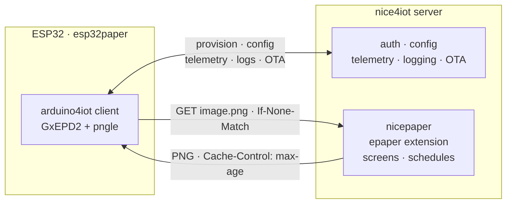

# esp32paper

Firmware for the **Waveshare ESP32 e-Paper Driver Board** that shows
[nicepaper](https://github.com/clausgf/nicepaper)-rendered images on an e-paper
panel. A battery-friendly, deep-sleep client of a
[nice4iot](https://github.com/clausgf/nice4iot) server, built on
[arduino4iot](https://github.com/clausgf/arduino4iot) and
[GxEPD2](https://github.com/ZinggJM/GxEPD2).

The device is deliberately thin: nice4iot handles provisioning, config,
telemetry, logging and OTA; nicepaper (the nice4iot `epaper` extension) renders
the screen — including its update schedule — server-side into a PNG. The
firmware wakes, fetches its image, paints it, and sleeps.

## Architecture



## How it works

One wakeup cycle (`setup()` runs, then deep sleep). The order is tuned for
energy — minimal work before the refresh, and the WiFi radio off *during* the
slow refresh:

1. **Connect** WiFi + NTP — `iot.begin()`
2. **Provision** (usually a no-op) — `api.updateProvisioningOk()`
3. **Config** (`config.json`; usually a 304) — `config.updateConfig()`
4. **GET image** with ETag / `If-None-Match` —
   `api.apiGet(".../ext/epaper/{project}/screens/{device}/image.png")`
5. **Render** (paged, PNG re-decoded per page) + WiFi/battery overlay —
   `displayRenderer.renderImage()`. While the panel refreshes (seconds, CPU
   idle), a busy-callback runs the **housekeeping** (OTA check, telemetry, log
   flush) and **switches WiFi off**.
6. **Deep sleep** for `Cache-Control: max-age` (clamped) — `iot.deepSleep()`

The schedule lives on the server: nicepaper's `max-age` from step 4 becomes the
next sleep duration. An unchanged screen returns `304` — no redraw (housekeeping
then runs inline). Serious failures show a **full-screen error page** and retry
after `error_retry_s`; the message matches the cause — no WiFi vs. failed NTP,
no server connection vs. provisioning rejected (classified from arduino4iot's
typed `IotResult`), or a missing/invalid image.

## Getting started

Needs [PlatformIO](https://platformio.org/) and a nice4iot server with the
`epaper` extension enabled and a screen assigned to this device (which writes
the device's `aliases.json` entry — see nicepaper's docs).

```bash
git clone <this-repo> esp32paper
cd esp32paper
cp include/settings.h.example include/settings.h   # WiFi + nice4iot; see Secrets
pio run -t upload
pio device monitor
```

### Panels

One firmware supports many panels. Enable any subset via `build_flags` in
`platformio.ini` (opt-in — all enabled drivers are compiled in); the **active
panel is chosen at runtime** from `config.json` `"panel"` → NVS → default. Only
the selected panel allocates its page buffer, so unused ones cost flash, not RAM.
The `color_model` sent to nicepaper is derived from the panel.

| build flag             | panel id          | panel                        | GxEPD2 driver             | color_model |
|------------------------|-------------------|------------------------------|---------------------------|-------------|
| `EPAPER_PANEL_42_BW`   | `gxepd2_420`      | 4.2" 400×300 b/w             | `GxEPD2_420`              | `bw`        |
| `EPAPER_PANEL_75_BW`   | `gxepd2_750_t7`   | 7.5" 800×480 b/w             | `GxEPD2_750_T7`           | `bw`        |
| `EPAPER_PANEL_75_BWR`  | `gxepd2_750c_z90` | 7.5" 800×480 b/w/red         | `GxEPD2_750c_Z90`         | `bwr`       |
| `EPAPER_PANEL_73_E6`   | `gxepd2_073e01`   | 7.3" 800×480 Spectra 6 (E6)  | `GxEPD2_730c_GDEP073E01`  | `e6`        |
| `EPAPER_PANEL_73_7C`   | `gxepd2_acep_730` | 7.3" 800×480 ACeP 7-colour   | `GxEPD2_730c_ACeP_730`    | `c7`        |

Set the panel per device in nice4iot's `config.json` (`"panel": "gxepd2_073e01"`);
it is persisted in NVS so later boots (and pre-config error screens) use the
right geometry. `EPAPER_DEFAULT_PANEL` sets the first-boot default (else the
first enabled panel). Pins are identical for all Waveshare HATs (`src/config.h`).
Requires `-DENABLE_GxEPD2_GFX=1` so the drivers share a common base (see
`src/panels.h`). Spectra 6 renders 6 colours, ACeP 7 (incl. orange); their 192 KB
bitmaps make paging mandatory — handled automatically
(see [Memory & paging](#memory--paging)). The runtime factory (`GxEPD2_GFX*`)
adds the panels' code to flash but no RAM for unused ones.

### Secrets

WiFi credentials and the provisioning token are **never committed** (`.gitignore`
excludes them; a missing one is a compile `#error`). The token is only needed for
first provisioning — arduino4iot seeds it into NVRAM once (`setProvisioningTokenIfEmpty`)
and thereafter uses the stored device token, so re-flashing does not re-provision.
To replace a *wrong* token later, erase NVS once (`pio run -t erase`). Provide
them via either:

- **`include/settings.h`** (default): `cp include/settings.h.example
  include/settings.h`. `#ifndef`-guarded, so build flags still win.
- **`secrets.ini`** (CI): `cp secrets.ini.example secrets.ini`, then uncomment
  `extra_configs` / `${secrets.build_flags}` in `platformio.ini`.

Either way the values end up in the firmware `.bin` — keeping them out of git
protects the source, not the binary.

**TLS** (only when `IOT_API_URL` is `https://`): a `WiFiClientSecure` must trust
the server or the handshake fails (`status=-1`). Set exactly one in `settings.h`:
`IOT_CA_CERT` (the server's CA, verified — recommended) or `IOT_TLS_INSECURE 1`
(encrypted but unverified — home lab only). See `settings.h.example`.

### Runtime config (`config.json`)

Served by nice4iot at `file/{project}/{device}/config.json`; all keys optional:

| key            | type   | default                                           | meaning |
|----------------|--------|---------------------------------------------------|---------|
| `log_level`    | int    | library default                                   | arduino4iot log verbosity |
| `sleep_s`      | int    | library default                                   | fallback sleep if no `max-age` |
| `panel`        | string | (NVS / build default)                             | panel id (see [Panels](#panels)); persisted in NVS, derives `color_model` |
| `image_path`   | string | `ext/epaper/{project}/screens/{device}/image.png` | image API path template |
| `min_sleep_s`  | int    | `300`                                             | lower clamp on `max-age` sleep |
| `max_sleep_s`  | int    | `86400`                                           | upper clamp on `max-age` sleep |
| `error_retry_s`| int    | `900`                                             | sleep after an error screen |
| `rotation`     | int    | `0`                                               | GxEPD2 rotation 0..3 |

### Monitoring

Everything flows through nice4iot:

- **System telemetry** — battery, RSSI, boot count, durations, firmware version
  (the arduino4iot standard set).
- **App telemetry** (`kind = "epaper"`), sent in the refresh overlap. Live:
  `connect_ms`, `net_ms`, `active_ms`, `image_status`, `image_bytes`,
  `image_maxage_s`, `displayed`, `heap_free`, `sleep_s`, `panel` (active id),
  `panels` (compiled-in panel ids). From the previous cycle
  (buffered in RTC RAM, since they only complete after the refresh):
  `last_cycle_ms`, `last_refresh_ms`, `last_decode_transfer_ms`.
- **Logging** — buffered, flushed in the overlap before WiFi off.

### Memory & paging

Plain **ESP32-WROOM-32 (4 MB flash, no PSRAM)**, ~180 KB free heap. The
refresh-time peak is the compressed PNG (`String`, ≤ ~40 KB) + pngle (~36 KB,
embeds the 32 KB DEFLATE window) + the GxEPD2 **page buffer**. The uncompressed
bitmap is never held whole: GxEPD2 renders in pages, the PNG re-decoded per page.
Page height is derived at compile time from a byte budget (`EPAPER_PAGE_BYTES`,
default 16 KB), so every panel is safe automatically:

| Panel | full bitmap | bytes/row | pages @16 KB | page buffer | render peak¹ |
|---|---|---|---|---|---|
| 4.2" b/w 400×300 | 15 KB | 50 | 1 (full) | 15 KB | ~91 KB |
| 7.5" b/w 800×480 | 48 KB | 100 | 4 | 16 KB | ~92 KB |
| 7.5" b/w/red 800×480 | 96 KB (2 planes) | 200 | 6 | 16 KB | ~92 KB |
| 7.3" Spectra 6 800×480 | 192 KB (4 bpp) | 400 | 12 | 16 KB | ~92 KB |
| 7.3" ACeP 7c 800×480 | 192 KB (4 bpp) | 400 | 12 | 16 KB | ~92 KB |

¹ PNG + pngle + page buffer, comfortably under ~180 KB.

GxEPD2's page buffer is an instance member whose `page_height` is a compile-time
template parameter (internal DRAM; PSRAM can't back it), so it can't be resized
at runtime — hence the compile-time byte budget plus a runtime free-heap guard
that refuses to decode below a safe threshold (and reports `heap_free` via
telemetry). In the multi-panel build only the runtime-selected panel is `new`'d,
so **only its buffer** uses RAM. Firmware size (this build, all five panels,
`min_spiffs.csv` partitions): flash ~68 % of a 1.875 MB OTA slot, static RAM
~15 % (the page buffer lives on the heap now, not `.bss`).

## Design notes

- **arduino4iot for everything but pixels** — provisioning, config, telemetry,
  logging and OTA are the library's; the firmware only adds the display path.
- **Thin client** — nicepaper sends a finished, palette-quantized PNG; no
  layout, fonts, dithering or schedule parsing on the device.
- **Sleep from `Cache-Control: max-age`** — nicepaper's cache header *is* the
  schedule, reused as sleep time (clamped to `min/max_sleep_s`).
- **Direct `apiGet` to the extension endpoint** — keeps the `ETag`/
  `Cache-Control` headers and library re-provisioning (unlike `apiForward`);
  path configurable via `image_path`.
- **Device addresses its screen by its own name** — `{device}` → screen via
  `aliases.json`; re-point server-side without reflashing.
- **ETag in RTC RAM** — sent as `If-None-Match`; `304` skips the redraw, the
  single biggest energy saving.
- **Paged rendering, budget-sized** — see [Memory & paging](#memory--paging); a
  validation decode runs first so a corrupt PNG never reaches the panel.
- **Multi-panel, runtime-selected** — all enabled panels compile in; a factory
  creates the one named by `config.json`/NVS/default as a `GxEPD2_GFX*` (needs
  `-DENABLE_GxEPD2_GFX=1`). Only the selected panel's page buffer is heap-
  allocated, so unused panels cost flash but no RAM (see `src/panels.h`).
- **Colour mapping matches the panel** — chosen at runtime from the panel:
  luma threshold (b/w), red test (b/w/red), nearest-of-6 (E6) or nearest-of-7
  (ACeP c7); nicepaper already quantized, so no dithering.
- **Client-side status overlay** — WiFi bars + battery gauge (live device state
  the server can't know), drawn top-right over every image.
- **Full-screen error pages** — icon + message (with `\n` paragraph breaks),
  retry after `error_retry_s`, so a blank/frozen panel never hides a fault. The
  cause is classified from arduino4iot's typed `IotResult` — transport/TLS vs.
  HTTP 403 vs. no-token vs. malformed body — so the screen is specific, not
  generic (no reachability guesswork).
- **Energy** — minimal work before the refresh; OTA/telemetry/logs overlap the
  refresh via GxEPD2's busy callback (run-once, with a fallback), then WiFi off;
  sleep duration computed beforehand. Watchdog widened to 90 s for the long
  refresh. Caveat: a real OTA *download* in that window reboots mid-refresh
  (harmless, re-rendered next boot).
- **End-of-cycle timings buffered in RTC RAM** — `refresh_ms`/
  `decode_transfer_ms`/`cycle_ms` complete only after the refresh, so they ship
  next cycle as `last_*` instead of keeping WiFi on; the refresh start is
  timestamped from GxEPD2's first busy-callback.
- **Opt-in panel list** (`EPAPER_PANEL_*`), **pioarduino platform**
  (arduino4iot needs arduino-esp32 3.x), **deep-sleep-first** (`loop()` unused;
  battery undervoltage → `iot.panic()`).
- **Secrets out of git, not out of the binary** — see [Secrets](#secrets).
- **Battery %** from a resting-voltage LiPo lookup table (approximate).

## Rendering ownership (using or replacing GxEPD2)

How much work to render into our own memory and use GxEPD2 only as a driver, or
drop it? GxEPD2 encapsulates each controller's init, waveform **LUTs**, refresh
and BUSY handling — effectively a driver library.

| approach | effort | what it buys |
|---|---|---|
| **A. Today** — GxEPD2 owns buffer + GFX + driver, paged, PNG re-decoded per page | none | works now; cost is N re-decodes and no runtime-variable banding |
| **B.** Own `Adafruit_GFX` buffer (overlay/text still work), GxEPD2 as low-level driver (`writeImage`/`writeNative`/`refresh`/BUSY) | ~1–2 days + per-panel HW bring-up | decode **once**; choose band height **at runtime** from free heap. Needs per-format native packing (1 bpp / 2 planes / 4 bpp) |
| **C.** Replace GxEPD2 | days–weeks per panel + waveform/ghosting debugging | nothing here |

**Recommendation:** stay on **A** — the energy design already removes the
dominant waste, and re-decode CPU is small next to refresh + radio. Consider
**B** only if profiling shows re-decode or fixed banding is a real cost; **C**
isn't worth it.

## TODO / open points

- [ ] **Not yet run on hardware.** All five panels build (4.2" b/w, 7.5" b/w,
      7.5" b/w/red, 7.3" Spectra 6, 7.3" ACeP 7-colour); SPI pins, refresh,
      overlay placement, runtime panel switching and colour mapping (`bwr`/`e6`/
      `c7`, paged `GxEPD2_3C`/`_7C`) need first-device verification.
- [ ] **First-boot geometry (multi-panel).** Before any `config.json`/NVS panel,
      a pre-config error screen renders on the compile-time default geometry
      (best effort) — wrong on a non-default device until config runs once.
- [ ] **Verify the refresh/housekeeping overlap on hardware.** Busy-callback
      timing, WiFi-off mid-refresh not disturbing the panel, and the 90 s
      watchdog — confirm on a real (esp. 7-colour) device; measure sleep current.
- [ ] **Confirm the extension endpoint accepts the device bearer token.** If
      nice4iot gates it only via per-project activation / `X-Api-Key` instead,
      switch to `apiForward` (losing header-driven sleep) — `image_path` is
      configurable.
- [ ] **Re-decode CPU vs. RAM.** Paged rendering re-decodes per page (+1 to
      validate); raise `EPAPER_PAGE_BYTES` for fewer pages when DRAM allows.
- [ ] **Battery curve is approximate** (resting-voltage table; sags under load).
      The board has no battery input by default — `BATTERY_*` assumes a 2:1
      divider on GPIO34; set `BATTERY_PIN = -1` if unused.
- [ ] **Overlay vs. server indicators** — nicepaper may draw its own; make the
      overlay config-toggleable or use a reserved corner.
- [ ] **Error path not energy-optimised** — error refreshes keep WiFi on (to
      flush the error log). Consider suppressing repeat redraws (track last error
      in RTC RAM) and backing off the retry interval.
- [ ] **Localisation** — only two error icons; English strings are hardcoded.
- [ ] **Partial refresh** — always full-window; partial updates could cut
      refresh time/power for small changes.
- [ ] **HTTP-only OTA** needs an IDF `CONFIG_OTA_ALLOW_HTTP=y` build; https works
      out of the box.

## Layout

```
esp32paper/
├── platformio.ini              # platform, libs, panel + page-budget build flags
├── secrets.ini.example         # copy to secrets.ini for build-flag secrets (CI)
├── include/settings.h.example  # copy to settings.h (WiFi + nice4iot secrets)
├── lib/pngle/                  # vendored PNG decoder
└── src/
    ├── config.h                # pins, panel opt-in flags, AppConfig defaults
    ├── panels.h                # panel registry + runtime factory (GxEPD2_GFX*)
    ├── display_renderer.{h,cpp}# GxEPD2 (paged) + pngle → panel, overlay, errors
    └── main.cpp                # the wakeup cycle
```

## Related projects

- [arduino4iot](https://github.com/clausgf/arduino4iot) — ESP32 IoT client library
- [nice4iot](https://github.com/clausgf/nice4iot) — self-hosted IoT server
- [nicepaper](https://github.com/clausgf/nicepaper) — screen renderer / `epaper` extension
- [GxEPD2](https://github.com/ZinggJM/GxEPD2) — e-paper display driver
