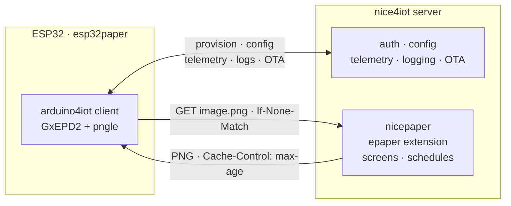

# esp32paper

Firmware for the **Waveshare ESP32 e-Paper Driver Board** or a **Seeed XIAO
ESP32-S3 (Plus)** on Seeed's **EE04 ePaper Display Board** that shows
[nicepaper](https://github.com/clausgf/nicepaper)-rendered images on an e-paper
panel. A battery-friendly, deep-sleep client of a
[nice4iot](https://github.com/clausgf/nice4iot) server, built on
[arduino4iot](https://github.com/clausgf/arduino4iot) and
[GxEPD2](https://github.com/ZinggJM/GxEPD2).

The device is deliberately thin: nice4iot handles provisioning, config,
telemetry, logging and OTA; nicepaper (the nice4iot `epaper` extension) renders
the screen — including its update schedule — server-side into a PNG. The
firmware wakes, fetches its image, paints it, and sleeps.

## Architecture


```mermaid
flowchart LR
    subgraph dev["ESP32 · esp32paper"]
        fw["arduino4iot client<br/>GxEPD2 + pngle"]
    end
    subgraph srv["nice4iot server"]
        core["auth · config<br/>telemetry · logging · OTA"]
        np["nicepaper<br/>epaper extension<br/>screens · schedules"]
    end
    fw <-->|"provision · config<br/>telemetry · logs · OTA"| core
    fw -->|"GET image.png · If-None-Match"| np
    np -->|"PNG · Cache-Control: max-age"| fw
```

## How it works

One wakeup cycle (`setup()` runs, then deep sleep). The order is tuned for
energy — as little as possible on the *radio-on* critical path before the
refresh, and everything else deferred so it overlaps the slow refresh with the
WiFi radio switched off part-way through:

1. **Connect** WiFi + NTP — `iot.begin()`. arduino4iot caches the last-good
   BSSID + channel in RTC RAM for a **scan-free reconnect** and throttles NTP
   resync to ~24 h; a **cached DHCP lease** (`iot.setDhcpCache()`, enabled here)
   reuses the last IP on the fast-reconnect path to skip the DHCP DORA.
2. **Provision** — `api.updateProvisioning()` (no round-trip while the device
   token is still valid)
3. **GET image** with ETag / `If-None-Match`, using the **NVS-cached config** —
   `api.apiGet(".../ext/epaper/{project}/screens/{device}/image.png")`
4. **Render** (paged, PNG re-decoded per page) + WiFi/battery overlay —
   `displayRenderer.renderImage()`. While the panel refreshes (seconds), a
   busy-callback runs the **housekeeping** — a throttled OTA check (`fw_check_s`),
   a `config.json` refresh *for the next cycle*, telemetry and log flush — then
   **switches WiFi off** before the refresh even finishes. For the remaining
   multi-second BUSY-wait the CPU **light-sleeps** in ~20 ms slices (~0.8 mA
   instead of busy-polling at full clock) until the panel signals done.
5. **Deep sleep**, schedule-aligned — `iot.deepSleep()`

The schedule lives on the server: nicepaper's `Cache-Control: max-age` from step
3 sets the next sleep. Rather than sleeping `max-age` from *cycle end* (which
would drift the next wake late by the whole active window — up to tens of seconds
on a 7-colour refresh), the device sleeps `max-age − elapsed-since-fetch`
(clamped to `[min_sleep_s, max_sleep_s]`), so wakeups stay aligned to the
schedule even for short intervals.

Config is used from NVS (cached from the previous cycle) and refreshed in the
background for the *next* cycle, keeping its round-trip off the critical path;
the very first boot (no cache yet) fetches it synchronously so the first render
already uses the configured panel. An unchanged screen returns **304** — no
redraw and no housekeeping either: the radio goes straight off and the wake is
merely counted (reported as `deferred_cycles` on the next telemetry POST). OTA
and telemetry catch up on the next cycle that actually refreshes.

Serious failures show a **full-screen error page** and retry after
`error_retry_s`; the message matches the cause — no WiFi vs. failed NTP, no
server connection vs. provisioning rejected (classified from arduino4iot's typed
`IotResult`), or a missing / invalid / wrong-sized image.

## Getting started

Needs [PlatformIO](https://platformio.org/) and a nice4iot server with the
`epaper` extension enabled and a screen assigned to this device (which writes
the device's `aliases.json` entry — see nicepaper's docs).

```bash
git clone <this-repo> esp32paper
cd esp32paper
cp include/settings.h.example include/settings.h   # WiFi + nice4iot; see Secrets
pio run -e waveshare_esp32_driver -t upload         # one-time SEED flash
pio device monitor
```

Use `-e seeed_xiao_esp32s3` instead for a XIAO ESP32-S3 (Plus) on the EE04
board. `pio run` with no `-e` builds **both** targets (used by CI).

That first flash **seeds** the bootstrap config (WiFi, endpoint, project, token,
TLS) into the device's NVS. Later firmware can be built **secretless** and reuses
those NVS values — so updates (and CI) need no secrets (see
[Firmware updates](#firmware-updates)).

### Boards

| env                      | board                                        | flash / PSRAM | pins |
|---------------------------|----------------------------------------------|---------------|------|
| `waveshare_esp32_driver`  | Waveshare ESP32 e-Paper Driver Board (ESP32-WROOM-32) | 4 MB / none | `src/config.h` (default) |
| `seeed_xiao_esp32s3`      | Seeed XIAO ESP32-S3 (Plus) on the EE04 ePaper Display Board (50-pin FPC) | 8 MB / 8 MB | `src/config.h` (`ARDUINO_XIAO_ESP32S3`) |

The EE04's ePaper power rail is gated by a pin (`EPD_ENABLE_PIN`) that
`display_renderer.cpp` drives HIGH before panel init. Its battery ADC also
sits behind an enable gate (`BATTERY_ADC_ENABLE_PIN`, driven HIGH at boot);
`BATTERY_FACTOR` assumes a 2:1 divider, unconfirmed — measure on real
hardware and correct it (`src/config.h`).

### Panels

One firmware supports many panels. Enable any subset via `build_flags` in
`platformio.ini` (opt-in — all enabled drivers are compiled in); the **active
panel is chosen at runtime** from `config.json` `"panel"` → NVS → default. Only
the selected panel allocates its page buffer, so unused ones cost flash, not RAM.
The `color_model` sent to nicepaper is derived from the panel.

| build flag             | panel id          | panel                        | GxEPD2 driver             | color_model |
|------------------------|-------------------|------------------------------|---------------------------|-------------|
| `PANEL_GDEW042T2`   | `GDEW042T2`      | 4.2" 400×300 b/w             | `GxEPD2_420`              | `bw`        |
| `PANEL_GDEW075T7`   | `GDEW075T7`   | 7.5" 800×480 b/w             | `GxEPD2_750_T7`           | `bw`        |
| `PANEL_GDEH075Z90`  | `GDEH075Z90` | 7.5" 800×480 b/w/red         | `GxEPD2_750c_Z90`         | `bwr`       |
| `PANEL_GDEP073E01`   | `GDEP073E01`   | 7.3" 800×480 Spectra 6 (E6)  | `GxEPD2_730c_GDEP073E01`  | `e6`        |
| `PANEL_ACEP730`   | `ACeP730` | 7.3" 800×480 ACeP 7-colour   | `GxEPD2_730c_ACeP_730`    | `c7`        |
| `PANEL_GDEY073D46` | `GDEY073D46`   | 7.3" 800×480 ACeP 7-colour   | `GxEPD2_730c_GDEY073D46`  | `c7`        |

Set the panel per device in nice4iot's `config.json` (`"panel": "GDEP073E01"`);
it is persisted in NVS so later boots (and pre-config error screens) use the
right geometry. `EPAPER_DEFAULT_PANEL` sets the first-boot default (else the
first enabled panel); this build ships it as `GDEW075T7` (7.5" 800×480 b/w,
e.g. the Seeed panel). Pins are identical for all Waveshare HATs (`src/config.h`).
Requires `-DENABLE_GxEPD2_GFX=1` so the drivers share a common base (see
`src/panels.h`). Spectra 6 renders 6 colours, ACeP 7 (incl. orange); their 192 KB
bitmaps make paging mandatory — handled automatically
(see [Memory & paging](#memory--paging)). The runtime factory (`GxEPD2_GFX*`)
adds the panels' code to flash but no RAM for unused ones.

### Secrets

Bootstrap values a device needs *before* it can reach the server — WiFi
credentials, API URL, project, provisioning token and TLS trust — are **seeded
into NVS once** (arduino4iot's `iot.seedCredentials()`), not compiled into every
build. A build carrying the `-D` defines is flashed once to seed a device; every
later build can be **secretless** (empty defaults) and reuses the NVS values.
None are ever committed (`.gitignore` excludes `include/settings.h` / `secrets.ini`).

Provide the seed values for the one-time flash via either:

- **`include/settings.h`** (default): `cp include/settings.h.example
  include/settings.h`. `#ifndef`-guarded, so build flags still win.
- **`secrets.ini`**: `cp secrets.ini.example secrets.ini`, then uncomment
  `extra_configs` / `${secrets.seed_flags}` in `platformio.ini`.

Seeding is **seed-if-absent**: existing NVS values are kept. To rotate a value,
change it and bump `IOT_SEED_GENERATION`, then re-flash once; `iot.factoryReset()`
clears everything. A firmware built *with* seed values holds them in plaintext in
the `.bin` (like any compiled-in string), so keep such a build local — never
publish it. The **secretless** build has none, which is what makes OTA updates and
[CI](#firmware-updates) safe on a public repo.

**TLS** (only when the seeded `IOT_API_URL` is `https://`): seeded via the TLS
mode. `settings.h.example` enables `IOT_TLS_CA_BUNDLE` → `IotTlsMode::Bundle`
(verify against the built-in Mozilla root bundle; works for Let's Encrypt & other
public CAs). Alternatives: `IOT_CA_CERT` → `CaPin` (pin a self-hosted/self-signed
CA) or `IOT_TLS_INSECURE` → `Insecure` (encrypted but unverified — home lab).

### Firmware updates

Because the bootstrap config lives in NVS (which OTA does not touch), a **single
secretless `firmware.bin` serves every device** — each reuses its own NVS seed.
So updates carry no credentials and can be built in public CI.

- **CI** (`.github/workflows/build.yml`) builds the secretless image for
  **both boards** on every push and uploads them as build artifacts; a
  **version tag** (`git tag v1.2.3 && git push --tags`) additionally publishes
  a GitHub Release with `firmware-waveshare_esp32_driver.bin` and
  `firmware-seeed_xiao_esp32s3.bin`.
- **Stable download endpoint** (public repo, no auth):
  `https://github.com/<owner>/<repo>/releases/latest/download/firmware-<env>.bin`.
  Each device's `IOT_BOARD_ID` build define (== its PlatformIO env, e.g.
  `waveshare_esp32_driver`) is reported as `board_id` telemetry and substituted
  for `{board}` in arduino4iot's default `updateFirmware()` path, so devices
  request `firmware-{board}.bin` themselves (arduino4iot >= v3.5.0) — copy the
  release asset straight into the project, no rename needed:
  `curl -fL <url> -o data/projects/<project>/firmware-<board>.bin` per board.
  arduino4iot then pulls its own on the next wakeup (ETag-conditional).
  (Build **artifacts** also exist but expire and need auth — prefer releases for a
  fixed URL. The release also carries `merged-<board>.bin`, a full-flash image
  with bootloader + partition table + app for flashing a blank board, and
  `partitions-<board>.csv`, that board's partition table in human-readable
  form.)
- GitHub Actions minutes are **free and unmetered for public repositories**
  (private repos on the Free plan get 2,000 min/month + 500 MB artifact storage),
  so building here has no practical per-build limit.

### Runtime config (`config.json`)

Served by nice4iot at `file/{project}/{device}/config.json`; all keys optional:

| key            | type   | default                                           | meaning |
|----------------|--------|---------------------------------------------------|---------|
| `log_level`    | int    | library default                                   | arduino4iot log verbosity |
| `sleep_s`      | int    | library default                                   | fallback sleep if no `max-age` |
| `panel`        | string | (NVS / build default)                             | panel id (see [Panels](#panels)); persisted in NVS, derives `color_model` |
| `image_path`   | string | `ext/epaper/{project}/screens/{device}/image.png` | image API path template |
| `min_sleep_s`  | int    | `300`                                             | lower clamp on `max-age` sleep |
| `max_sleep_s`  | int    | `86400`                                           | upper clamp on `max-age` sleep |
| `error_retry_s`| int    | `900`                                             | sleep after an error screen |
| `rotation`     | string | `0deg`                                            | GxEPD2 rotation: `0deg`, `90deg`, `180deg`, `270deg` |
| `fw_check_s`   | int    | `86400`                                           | min seconds between OTA checks (`0` = every wake) |

Changing a key takes effect on the *next* cycle (config is refreshed in the
background — see [How it works](#how-it-works)).

### Monitoring

Everything flows through nice4iot:

- **System telemetry** — battery, RSSI, boot count, durations, and firmware
  identity (the arduino4iot standard set): `firmware_id` (full build string) and
  `firmware_version` — a single `git describe --tags --dirty --always` of *this*
  repo, derived at build time by a script arduino4iot ships (e.g. `0.11.0`, or
  `0.11.0-3-gabc123-dirty` past a tag), so it identifies the actual firmware with
  no code here; `firmware_sha256` is the app-image hash.
- **App telemetry** (`kind = "epaper"`), sent in the refresh overlap. Live:
  `connect_ms`, `net_ms`, `active_ms`, `image_status`, `image_bytes`,
  `image_maxage_s`, `displayed`, `heap_free`, `sleep_s`, `panel` (active id),
  `panels` (compiled-in panel ids). From the previous cycle (buffered in RTC RAM,
  since they only complete after the refresh / WiFi-off): `last_cycle_ms`,
  `last_refresh_ms`, `last_decode_transfer_ms`, `last_radio_on_ms` (WiFi-on
  window — the dominant energy metric), and `deferred_cycles` (silent `304` wakes
  skipped since the last POST). Together these let the phase durations be
  reconstructed without the serial log.
- **Serial phase markers** — `panel refresh: start` / `… done in X ms`, `WiFi off
  — radio on for X ms`, and an end-of-cycle `cycle phases [ms]: connect=… net=…
  decode_transfer=… refresh=… radio_on=… active=…` summary.
- **Logging** — buffered, flushed in the overlap before WiFi off.

### Memory & paging

Plain **ESP32-WROOM-32 (4 MB flash, no PSRAM)**, ~180 KB free heap. The
refresh-time peak is the compressed PNG (`String`, ≤ ~40 KB) + pngle (~36 KB,
embeds the 32 KB DEFLATE window) + the GxEPD2 **page buffer**. The uncompressed
bitmap is never held whole: GxEPD2 renders in pages, the PNG re-decoded per page.
Page height is derived at compile time from a byte budget (`EPAPER_PAGE_BYTES`,
default 16 KB), so every panel is safe automatically:

| Panel | full bitmap | bytes/row | pages @16 KB | page buffer | render peak¹ |
|---|---|---|---|---|---|
| 4.2" b/w 400×300 | 15 KB | 50 | 1 (full) | 15 KB | ~91 KB |
| 7.5" b/w 800×480 | 48 KB | 100 | 4 | 16 KB | ~92 KB |
| 7.5" b/w/red 800×480 | 96 KB (2 planes) | 200 | 6 | 16 KB | ~92 KB |
| 7.3" Spectra 6 800×480 | 192 KB (4 bpp) | 400 | 12 | 16 KB | ~92 KB |
| 7.3" ACeP 7c 800×480 | 192 KB (4 bpp) | 400 | 12 | 16 KB | ~92 KB |

¹ PNG + pngle + page buffer, comfortably under ~180 KB.

GxEPD2's page buffer is an instance member whose `page_height` is a compile-time
template parameter (internal DRAM; PSRAM can't back it), so it can't be resized
at runtime — hence the compile-time byte budget plus a runtime free-heap guard
that refuses to decode below a safe threshold (and reports `heap_free` via
telemetry). In the multi-panel build only the runtime-selected panel is `new`'d,
so **only its buffer** uses RAM. Firmware size (this build, all five panels,
`min_spiffs.csv` partitions): flash ~68 % of a 1.875 MB OTA slot, static RAM
~15 % (the page buffer lives on the heap now, not `.bss`).

## Design notes

- **arduino4iot for everything but pixels** — provisioning, config, telemetry,
  logging and OTA are the library's; the firmware only adds the display path.
- **Thin client** — nicepaper sends a finished, palette-quantized PNG; no
  layout, fonts, dithering or schedule parsing on the device.
- **Sleep from `Cache-Control: max-age`** — nicepaper's cache header *is* the
  schedule, reused as sleep time (clamped to `min/max_sleep_s`).
- **Direct `apiGet` to the extension endpoint** — keeps the `ETag`/
  `Cache-Control` headers and library re-provisioning (unlike `apiForward`);
  path configurable via `image_path`.
- **Device addresses its screen by its own name** — `{device}` → screen via
  `aliases.json`; re-point server-side without reflashing.
- **ETag in RTC RAM** — sent as `If-None-Match`; `304` skips the redraw, the
  single biggest energy saving.
- **Paged rendering, budget-sized** — see [Memory & paging](#memory--paging); a
  validation decode runs first so a corrupt PNG never reaches the panel.
- **Multi-panel, runtime-selected** — all enabled panels compile in; a factory
  creates the one named by `config.json`/NVS/default as a `GxEPD2_GFX*` (needs
  `-DENABLE_GxEPD2_GFX=1`). Only the selected panel's page buffer is heap-
  allocated, so unused panels cost flash but no RAM (see `src/panels.h`).
- **Colour mapping matches the panel** — one code path: a nearest-RGB match
  against the active panel's palette (2 colours b/w, 3 b/w/red, 6 Spectra 6, 7
  ACeP c7). nicepaper already quantized to that palette, so the match is exact
  and there is no dithering. Palettes are panel data in `src/panels.h`.
- **Client-side status overlay** — WiFi bars + battery gauge (live device state
  the server can't know), drawn top-right over every image.
- **Full-screen error pages** — icon + message (with `\n` paragraph breaks),
  retry after `error_retry_s`, so a blank/frozen panel never hides a fault. The
  cause is classified from arduino4iot's typed `IotResult` — transport/TLS vs.
  HTTP 403 vs. no-token vs. malformed body — so the screen is specific, not
  generic (no reachability guesswork). A valid PNG whose size ≠ the panel
  (rotation-aware) is rejected too, with the got-vs-expected dimensions — else
  GxEPD2 would silently clip/misplace it and show garbage with no error.
- **Energy** — as little as possible on the radio-on critical path: config is
  used from the NVS cache and refreshed in the background for the *next* cycle,
  the OTA check is throttled (`fw_check_s`), and OTA/telemetry/logs overlap the
  refresh via GxEPD2's busy callback (run-once, with a fallback) before WiFi
  switches off. Once housekeeping is done and the radio is off, the CPU
  **light-sleeps** through the rest of the multi-second refresh (the busy
  callback naps in ~20 ms slices, ~0.8 mA vs. ~40 mA busy-polling) instead of
  spinning on BUSY. A `304` (unchanged) skips housekeeping entirely — radio straight
  off, the wake merely counted as `deferred_cycles`. Sleep is **schedule-aligned**
  (`max-age − elapsed-since-fetch`) so wakeups don't drift late by the refresh.
  Scan-free WiFi reconnect + cached DHCP lease (`setDhcpCache`) come from
  arduino4iot, skipping the scan and DHCP DORA each wake. Watchdog
  widened to 90 s for the long refresh. Caveat: a real OTA *download* in that
  window reboots mid-refresh (harmless, re-rendered next boot).
- **End-of-cycle timings buffered in RTC RAM** — `refresh_ms`/
  `decode_transfer_ms`/`cycle_ms` complete only after the refresh, so they ship
  next cycle as `last_*` instead of keeping WiFi on; the refresh start is
  timestamped from GxEPD2's first busy-callback.
- **Opt-in panel list** (`PANEL_*`), **pioarduino platform**
  (arduino4iot needs arduino-esp32 3.x), **deep-sleep-first** (`loop()` unused;
  battery undervoltage → `iot.panic()`).
- **Secrets seeded into NVS, not baked into every build** — one secretless image
  serves all devices and enables public CI/OTA (see [Secrets](#secrets)).
- **Battery %** from a resting-voltage LiPo lookup table (approximate).

## Rendering ownership (using or replacing GxEPD2)

How much work to render into our own memory and use GxEPD2 only as a driver, or
drop it? GxEPD2 encapsulates each controller's init, waveform **LUTs**, refresh
and BUSY handling — effectively a driver library.

| approach | effort | what it buys |
|---|---|---|
| **A. Today** — GxEPD2 owns buffer + GFX + driver, paged, PNG re-decoded per page | none | works now; cost is N re-decodes and no runtime-variable banding |
| **B.** Own `Adafruit_GFX` buffer (overlay/text still work), GxEPD2 as low-level driver (`writeImage`/`writeNative`/`refresh`/BUSY) | ~1–2 days + per-panel HW bring-up | decode **once**; choose band height **at runtime** from free heap. Needs per-format native packing (1 bpp / 2 planes / 4 bpp) |
| **C.** Replace GxEPD2 | days–weeks per panel + waveform/ghosting debugging | nothing here |

**Recommendation:** stay on **A** — the energy design already removes the
dominant waste, and re-decode CPU is small next to refresh + radio. Consider
**B** only if profiling shows re-decode or fixed banding is a real cost; **C**
isn't worth it.

## TODO / open points

- [ ] **Not yet run on hardware.** All five panels build (4.2" b/w, 7.5" b/w,
      7.5" b/w/red, 7.3" Spectra 6, 7.3" ACeP 7-colour) on both boards; SPI pins,
      refresh, overlay placement, runtime panel switching and colour mapping
      (`bwr`/`e6`/`c7`, paged `GxEPD2_3C`/`_7C`) need first-device verification.
      `seeed_xiao_esp32s3`'s pin mapping (`EPD_ENABLE_PIN` power gate incl.) is
      sourced from Seeed's docs/library, not hardware-tested here.
- [ ] **First-boot geometry (multi-panel).** Before any `config.json`/NVS panel,
      a pre-config error screen renders on the compile-time default geometry
      (best effort) — wrong on a non-default device until config runs once.
- [ ] **Verify the refresh/housekeeping overlap on hardware.** Busy-callback
      timing, the light-sleep BUSY-wait sampling the panel correctly, WiFi-off
      mid-refresh not disturbing the panel, and the 90 s watchdog — confirm on a
      real (esp. 7-colour) device; measure the refresh-phase and sleep current.
- [ ] **Per-wake TLS handshake** still dominates the (already lean) unchanged-image
      wake. Tracked upstream as arduino4iot#3 (TLS session resumption across deep
      sleep, ~2 s) — not yet released. DHCP is already skipped (arduino4iot#4 →
      `setDhcpCache`, shipped in v3.4 and enabled here, ~0.4 s).
- [ ] **Confirm the extension endpoint accepts the device bearer token.** If
      nice4iot gates it only via per-project activation / `X-Api-Key` instead,
      switch to `apiForward` (losing header-driven sleep) — `image_path` is
      configurable.
- [ ] **Re-decode CPU vs. RAM.** Paged rendering re-decodes per page (+1 to
      validate); raise `EPAPER_PAGE_BYTES` for fewer pages when DRAM allows.
- [ ] **Battery curve is approximate** (resting-voltage table; sags under load).
      The board has no battery input by default — `BATTERY_*` assumes a 2:1
      divider on GPIO34; set `BATTERY_PIN = -1` if unused.
- [ ] **Overlay vs. server indicators** — nicepaper may draw its own; make the
      overlay config-toggleable or use a reserved corner.
- [ ] **Error path not energy-optimised** — error refreshes keep WiFi on (to
      flush the error log). Consider suppressing repeat redraws (track last error
      in RTC RAM) and backing off the retry interval.
- [ ] **Localisation** — only two error icons; English strings are hardcoded.
- [ ] **Partial refresh** — always full-window; partial updates could cut
      refresh time/power for small changes.
- [ ] **HTTP-only OTA** needs an IDF `CONFIG_OTA_ALLOW_HTTP=y` build; https works
      out of the box.

## Layout

```
esp32paper/
├── platformio.ini              # platform, libs, panel + page-budget build flags
├── secrets.ini.example         # copy to secrets.ini for build-flag secrets (CI)
├── include/settings.h.example  # copy to settings.h (WiFi + nice4iot secrets)
├── lib/pngle/                  # vendored PNG decoder
└── src/
    ├── config.h                # pins, panel opt-in flags, AppConfig defaults
    ├── panels.h                # panel registry + runtime factory (GxEPD2_GFX*)
    ├── display_renderer.{h,cpp}# GxEPD2 (paged) + pngle → panel, overlay, errors
    └── main.cpp                # the wakeup cycle
```

## Related projects

- [arduino4iot](https://github.com/clausgf/arduino4iot) — ESP32 IoT client library
- [nice4iot](https://github.com/clausgf/nice4iot) — self-hosted IoT server
- [nicepaper](https://github.com/clausgf/nicepaper) — screen renderer / `epaper` extension
- [GxEPD2](https://github.com/ZinggJM/GxEPD2) — e-paper display driver
